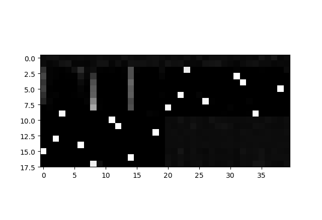
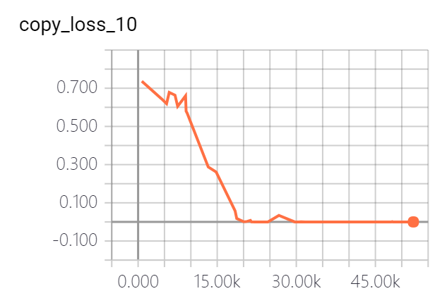
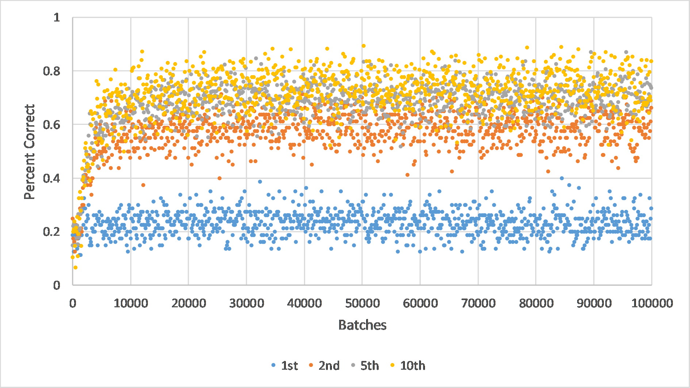
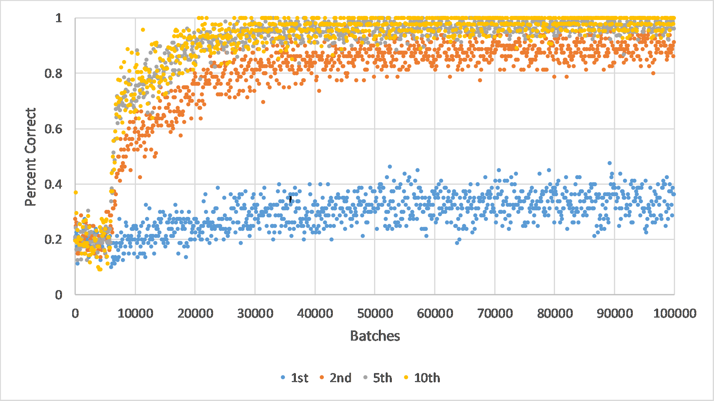
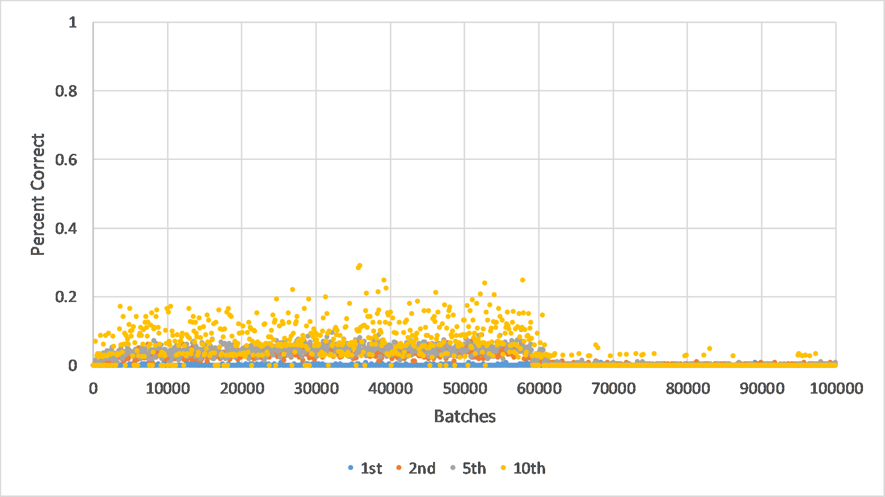
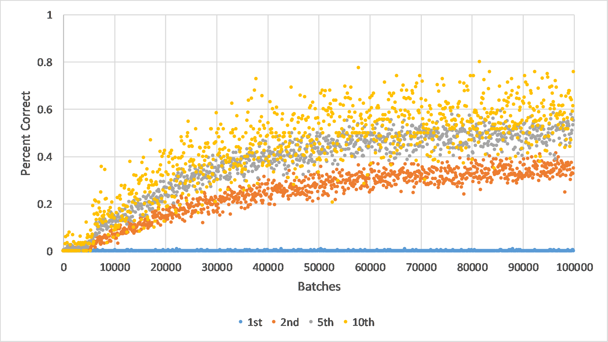

# NTM and MANN in TensorFlow

TensorFlow implementation of Neural Turing Machines (NTM), as well as its application on one-shot learning (MANN). 

The models are ready to use -- they are encapsulated into classes `NTMCell` and `MANNCell`, and the usage is similar to `LSTMCell` in TensorFlow, so you can apply these models easily in other programs. The sample code is also provided.

You can see [my slide](https://docs.google.com/presentation/d/1FqU7q-vWN9uV7sMRt9It9F_el9nIdqzBfMPm91hJ4B0/edit?usp=sharing) for more details about NTM and MANN.

## Prerequisites

* Python 3.5
* TensorFlow 1.2.0
* NumPy
* Pillow (For MANN, prepoccessing of Omniglot dataset)

## Implementation of NTM

### Paper

Graves, Alex, Greg Wayne, and Ivo Danihelka. "[Neural turing machines.](https://arxiv.org/abs/1410.5401)" _arXiv preprint arXiv:1410.5401_ (2014).

### Usage

#### Class NTMCell()

The usage of class `NTMCell` in `ntm/ntm_cell.py` is similar to `tf.contrib.rnn.BasicLSTMCell` in TensorFlow. The basic pseudocode is as follows:

```python
import ntm.ntm_cell as ntm_cell
cell = ntm_cell.NTMCell(
    rnn_size=200,           # Size of hidden states of controller 
    memory_size=128,        # Number of memory locations (N)
    memory_vector_dim=20,   # The vector size at each location (M)
    read_head_num=1,        # # of read head
    write_head_num=1,       # # of write head
    addressing_mode='content_and_location', # Address Mechanisms, 'content_and_location' or 'content'
    reuse=False,            # Whether to reuse the variable in the model (if the length of sequence is not fixed, you might need to build more than one model using the same variable, and this will be useful)
)
state = cell.zero_state(batch_size, tf.float32)
output_list = []
for t in range(seq_length):
    output, state = cell(input[i], state)
    output_list.append(output)
```

#### Train and Test

To train the model, run:

```
python copy_task.py
```
You can specify training options including parameters to the model via flags, such as `--model` (default is NTM), `--batch_size` and so on. See code for more detail.

To test the model, run:

```
python copy_task.py --mode test
```

You can specify testing options via flags such as `--test_seq_length`.

### Result (Copy task)

 | 
---|---
Vector of weighting (left: read vector; right: write vector; shift range: 1) | Training loss

## One-shot Learning with NTM (MANN)

### Paper

Santoro, Adam, et al. "[One-shot learning with memory-augmented neural networks.](https://arxiv.org/abs/1605.06065)" _arXiv preprint arXiv:1605.06065_ (2016).

### Usage

#### Class MANNCell()

The usage of class `MANNCell` in `ntm/mann_cell.py` is similar to `tf.contrib.rnn.BasicLSTMCell` in TensorFlow. The basic pseudocode is as follows:

```python
import ntm.mann_cell as mann_cell
cell = mann_cell.MANNCell(
    rnn_size=200,           # Size of hidden states of controller 
    memory_size=128,        # Number of memory locations (N)
    memory_vector_dim=40,   # The vector size at each location (M)
    head_num=1,             # # of read & write head (in MANN, #(read head) = #(write head))
    gamma=0.95              # Usage decay of the write weights (in eq 20)
    k_strategy='separate'   # In the original MANN paper, query key vector 'k' are used in both reading (eq 17) and writing (eq 23). You can set k_strategy='summary' if you want this way. However, in the NTM paper they are esparated. If you set k_strategy='separate', the controller will generate a new add vector 'a' to replace the query vector 'k' in eq 23.
)
state = cell.zero_state(batch_size, tf.float32)
output_list = []
for t in range(seq_length):
    output, state = cell(input[i], state)
    output_list.append(output)
```

There is another implementation of `MANNCell` translated from [tristandeleu's Theano version of MANN](https://github.com/tristandeleu/ntm-one-shot). You can find it in `ntm/mann_cell_2.py` and the usage is just the same. The performance is not fully tested but it seems to work fine too.

#### Train and Test

To train the model, first you need to prepare the Omniglot dataset. Download [images_background.zip](https://github.com/brendenlake/omniglot/blob/master/python/images_background.zip) (964 classes) and [images_evaluation.zip](https://github.com/brendenlake/omniglot/blob/master/python/images_evaluation.zip) (679 classes), then combine them in a new `data` folder so you have 1623 classes. Your `data` folder may looks like:

    /data
        /Alphabet_of_the_Magi
            /character01
                0709_01.png
                ...
                0709_20.png
            ...
            /character20
        ...
        /ULOG

Then, run:

```
python one_shot_learning.py
```

You can specify training options including parameters to the model via flags, such as `--model` (default is MANN), `--batch_size` and so on. See code for more detail.

To test the model, run:

```
python one_shot_learning.py --mode test
```

You can specify testing options via flags such as `--test_batch_num` (default: 100), `--n_train_classes` (default: 1200) and `--n_test_classes` (default: 423).

### Result

Omniglot Classification:

 | 
---|---
LSTM, five random classes/episode, one-hot vector labels | MANN, five random classes/episode, one-hot vector labels
 | 
LSTM, fifteen random classes/episode, five-character string labels | MANN, fifteen random classes/episode, five-character string labels

Test-set classification accuracies for LSTM and MANN trained on the Omniglot dataset, using one-hot encodings of labels and five classes presented per episode:

Model | 1st | 2nd | 3rd | 4th | 5th | 6th | 7th | 8th | 9th | 10th | loss
---|---|---|---|---|---|---|---|---|---|---|---
LSTM | 0.2333 | 0.5897 | 0.6581 | 0.681 | 0.7077 | 0.7156 | 0.7141 | 0.7305 | 0.7281 | 0.7233 | 42.6427
MANN | 0.3558 | 0.8881 | 0.9497 | 0.9651 | 0.9734 | 0.9744 | 0.9794 | 0.9798 | 0.978 | 0.9755 | 11.531